# 使用 CubeMX 生成 RT-Thread nano 工程

##  背景内容简介

RT-Thread Nano 是 RT-Thread 推出的极简版实时操作系统，占用较小的资源，适用于家电、消费电子、医疗设备、工控等领域大量使用的 32 位 ARM 入门级 MCU 的场合，如果需要丰富的组件、驱动以及软件包等功能，则需参考 [rt-thread](https://github.com/RT-Thread/rt-thread)。

本文主要介绍使用CubeMX 生成 RT-Thread nano 工程，并且展示基于 STM32L475VE（RT-Thread 与正点原子联合开发的`iot` 开发板，命为“潘多拉”）MCU 的示例工程。 

## 准备材料

### 获取 CubeMX 

CubeMX 官网下载地址 <https://www.st.com/en/development-tools/stm32cubemx.html> 。本文讲解的工程是基于 CubeMX 5.0.0，如果比较低的版本，建议升级，升级方式： help -> Check for updates，进入后，点击 Refresh，CubeMX 自动去获取最新的程序，成功获取后选择版本，点击 `Install now`，完成安装，重启启动程序即可。

### 获取 RT-Thread nano 软件包

分两种情况，如果是升级RT-Thread nano 软件包，阅读 **(a)升级软件包**章节，如果是添加添加 RT-Thread nano 软件包，阅读**(b)添加软件包**章节。

**（a）升级软件包**

如果之前安装过 RT-Thread nano 软件包，此时只需要升级该软件包即可。nano 升级方式：打开CubeMX--菜单栏 help -> Manage embedded software packages -> Refresh -> Install Now -> Licensing Agreement -> Finish。

具体如下进入打开CubeMX，从菜单栏 help 进入 Manage embedded software packages 界面，点击 Refresh 后，等待从服务器获取新版本，获取成功后，如下图所示

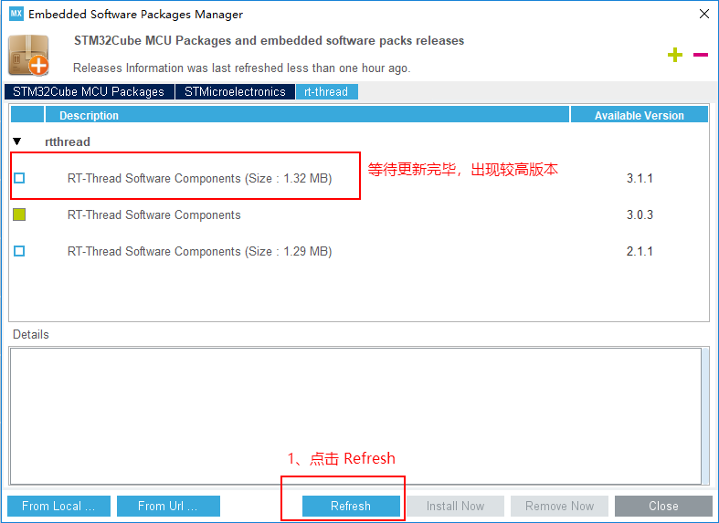

成功获取后，选择新的 RT-Thread nano 软件包， Install Now 按钮有灰色变成蓝色，并且点击这个按钮，如下图所示

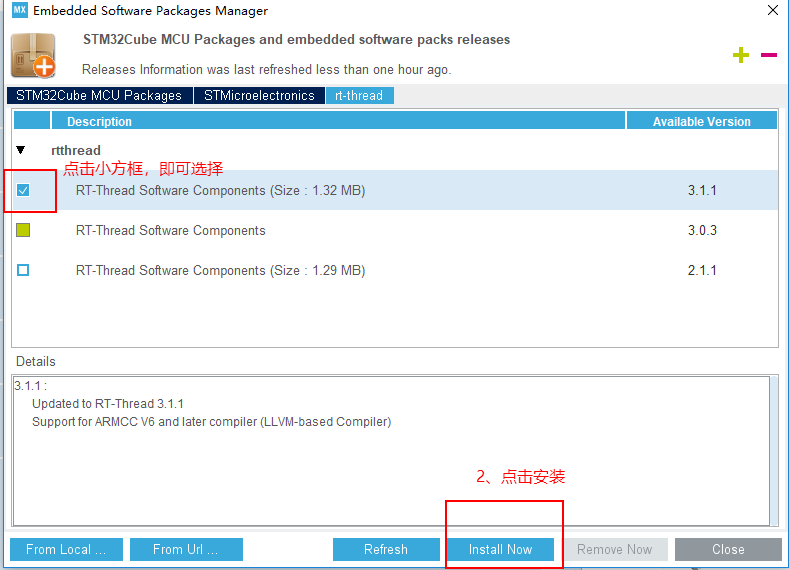

点击安装之后，弹出 Licensing Agreement ，同意协议，点击 Finish，如下图所示

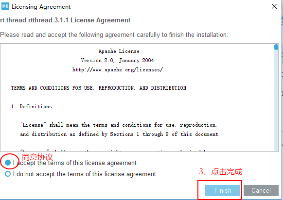

等待完成安装，完成之后，如下图所示


至此，RT-Thread nano 软件包安装完毕，选择退出 Manage embedded software packages 界面，进入CubeMX 主界面。另外，如果不需要之前的版本，可以选中之前的版本，点击Remove Now 即可。

**（b）添加软件包**

如果之前没有安装 RT-Thread nano 软件包，则需要在 CubeMX 中添加 <https://www.rt-thread.org/download/cube_pack/rt-thread.rtthread.pdsc> ，流程如下： 打开CubeMX--菜单栏 help -> Manage embedded software packages -> From Url... -> new->填入上述地址 ->check ->OK ->进入Manage embedded software packages界面 ->选择 nano 软件包->Install Now -> 同意协议 -> 点击 Finish。

具体如下进入打开CubeMX，从菜单栏 help 进入 Manage embedded software packages 界面，点击 From Url 按钮 进入 User Defined Packs Manager 界面，点击 new，填入本小节的上述网址，然后点击 check，如下图所示

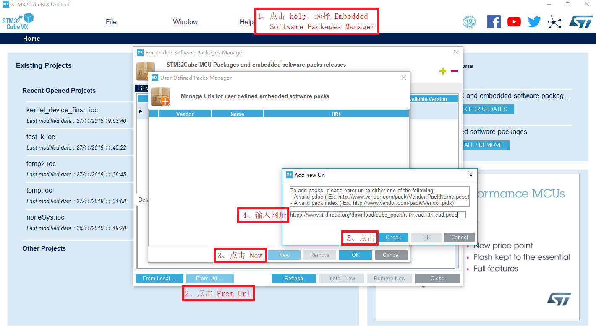

check 通过后，点击 ok，回到 User Defined Packs Manager 界面，再次点击 OK，回到 Manage embedded software packages 界面，展开 rtthread，就会发现 RT-Thread nano 软件包的不同版本，选择最新版本的软件包，点击 Install Now，如下图所示

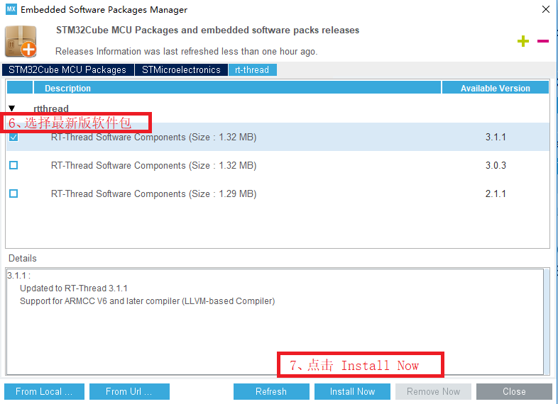

点击安装之后，弹出 Licensing Agreement ，同意协议，点击 Finish，如下图所示

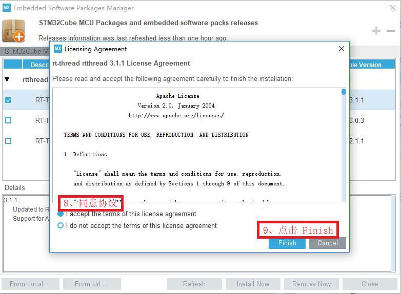

等待 nano 包的安装完成，版本前面的小蓝色框变成填充的黄绿色，如下图所示

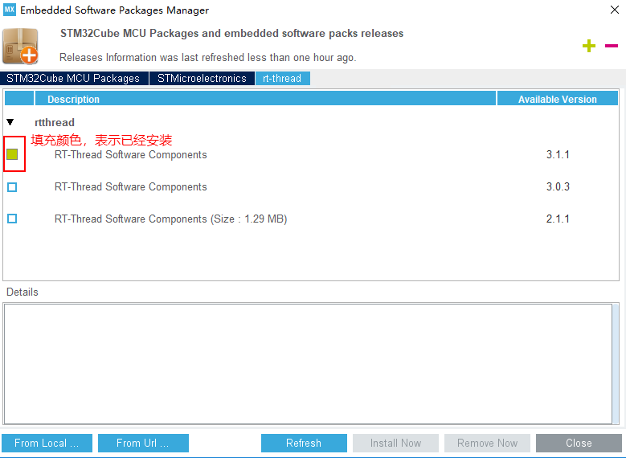

至此，RT-Thread nano 软件包安装完毕，选择退出 Manage embedded software packages 界面，进入CubeMX 主界面。

## 生成工程

本节主要介绍基于 RT-Thread nano 软件包 3.1.1 版本，生成示例工程，示例工程位于<https://github.com/ErnestChen1/CubeMX-generator-wizard/tree/master/rt-thread_test>。

### 创建新工程

在 CubeMX 主界面的菜单栏中 File 选择 New Project，如下图所示

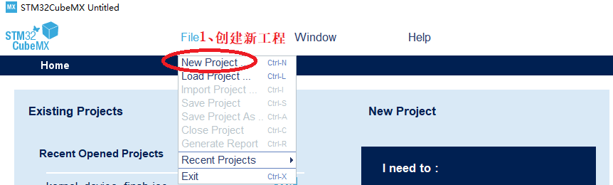

### 选择芯片型号

新建工程之后，在弹出界面芯片型号中输入 STM32L475VE，双击选中的芯片，如下图所示

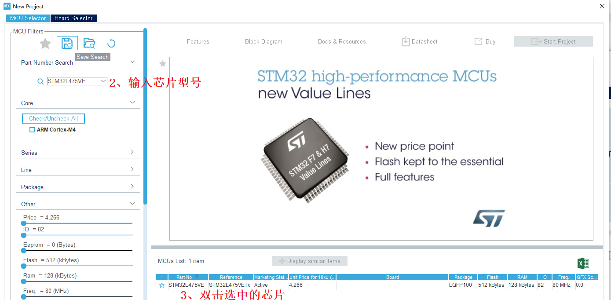

### 选中 RT-Thread 组件

选中芯片型号之后，点击 Additional Softwares，进入 Additional Software Components selection界面，展开 rt-thread， 选则 kernel，然后点击 OK 按钮，如下图所示

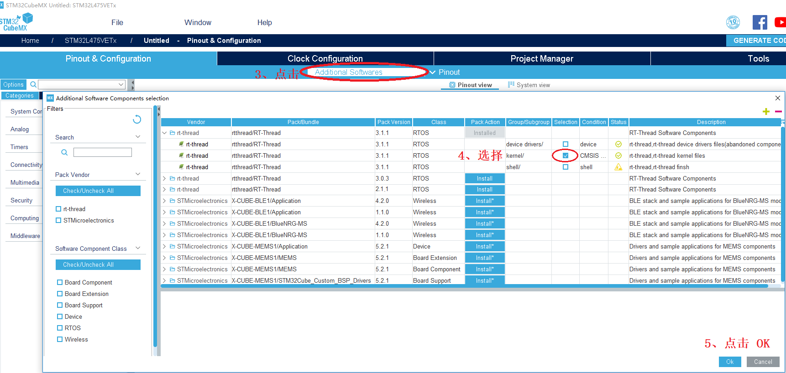

### 配置 RT-Thread 组件

完成了第五步之后，进入到工程界面，在 Pinout & Configuration中，按照下图配置 RT-Thread

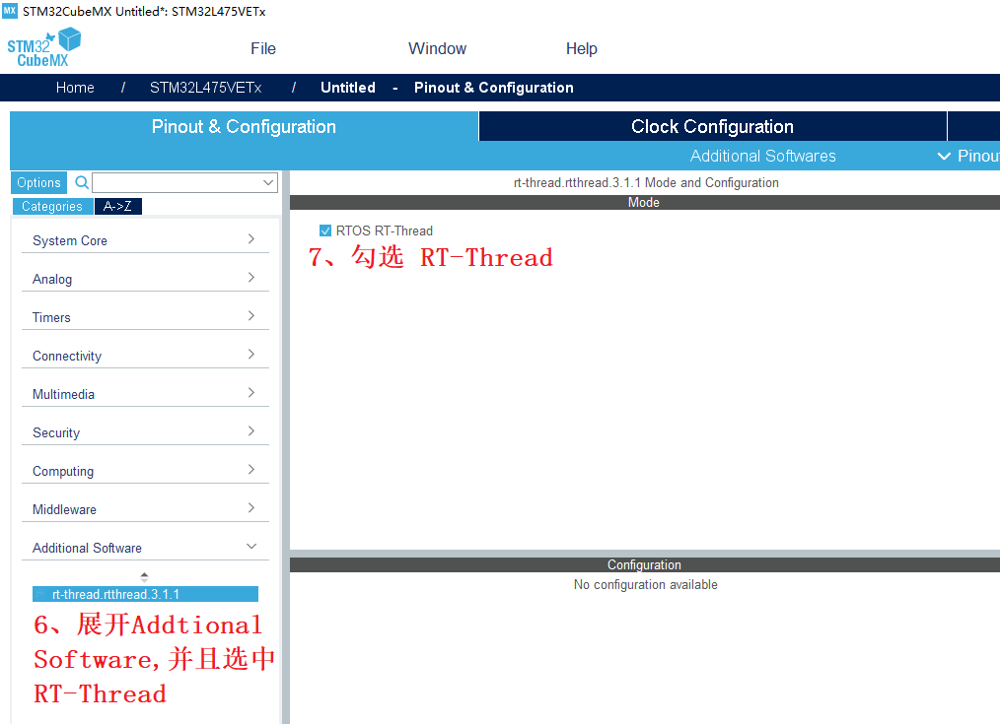

- 注：

  configuration 区域是否有需要配置的，取决于选中的 RT-Thread组件内容。

### 工程管理

给工程取名、选择代码存放位置、选择生成代码的工具链/IDE，本例程从下拉框中选择 MDK5，操作如图所示

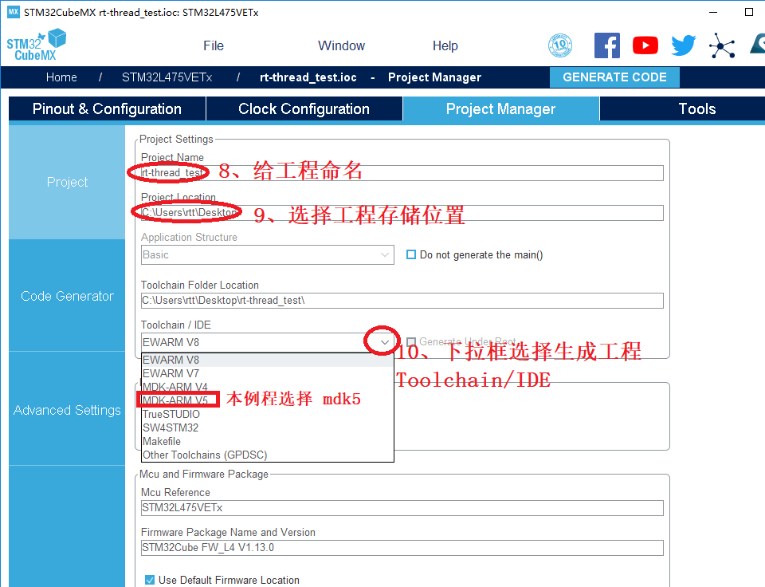

### 配置引脚

例程主要点亮 LED 灯，配置 MCU 引脚 PE7，PE8，PE9，分别为红色、绿色、蓝色的 LED 灯，配置的引脚 PD8，PD9，PD10 分别为按键 key2，key1，key0。例如配置引脚 PD10，在 Pinout view 界面，鼠标左键单击，在选项中选择 GPIO_Input 模式，如下所示

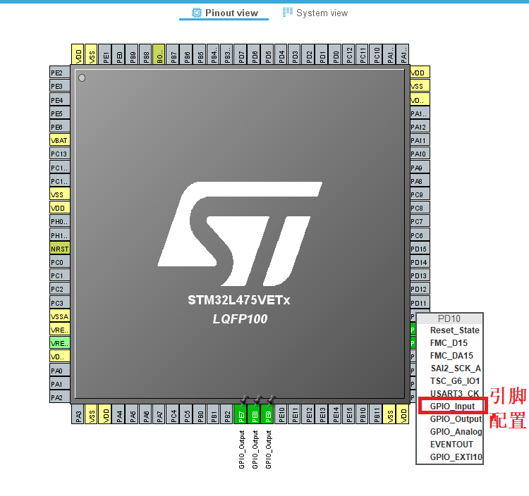

### 中断配置

RT-Thread 操作系统重定义的`HardFault_Handler`、`PendSV_Handler`、`SysTick_Handler` 中断函数，为了避免重复，在生成工程之前，需要在中断配置中，代码生成的选项中，取消选择三个中断函数（对应注释选项是 `Hard fault interrupt`, `Pendable request`, `Time base :System tick timer`），最后点击生成代码，具体操作如下图所示

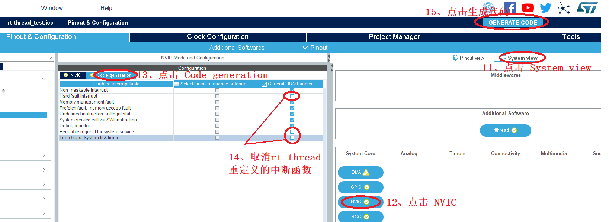

### 打开生成的工程

等待工程生成完毕，点击打开工程，如下图所示，即可进入 mdk5 工程中


## 添加用户代码

进入 Keil 工程后，点击编译，编译无误则表示代码生成成功，如有错误，请参照下节进行修改。

Keil 工程中添加源文件 `thread_test`，位于<>

由于上述示例代码中使用了事件，所以需要配置文件中打开相关的配置。在keil 中打开 `rtconfig.h` 文件，点击 `Configuration Wizard`，展开 IPC，在里面选择使用 `Using Event`，具体如下图所示

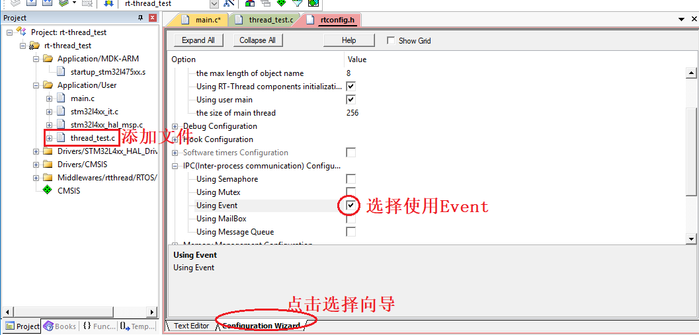

找到并且打开 `main.c` 文件，在 `main()` 函数前面添加
```c
extern void MX_rtthread_Process(void)//示例代码入口
```

将 `main()` 函数中的`while{}` 部分代码替换为 `MX_rtthread_Process();` 如下图所示

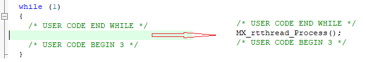

最后，重新编译程序，下载程序到开发板。实验现象是按下 key0 亮红灯，按下 key1 亮绿灯，按下 key2 亮蓝灯。

## 可能遇到的问题

1、出现三个中断重复定义

解决方式参考生成工程章节中**中断配置**小节。

2、生成工程不包含 rt-thread

解决方式参考生成工程章节中**选中 RT-Thread 组件**小节。

3、生成工程，不包含 .S 文件

已知问题，生成的工程中发现 context_rvds.S， context_iar.S 或者其他文件存在丢失的情况，建议重新使用 cubeMX 生成工程。


